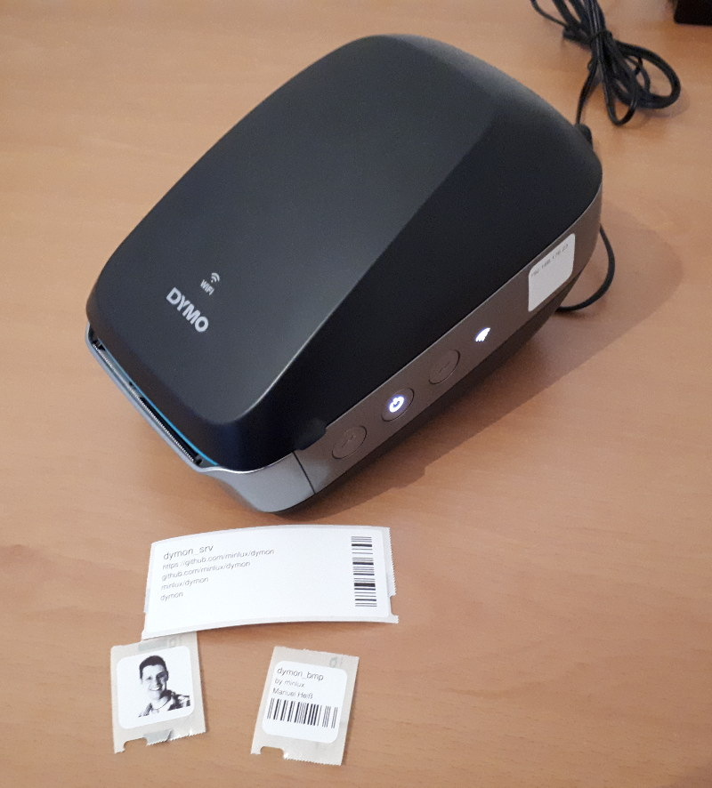
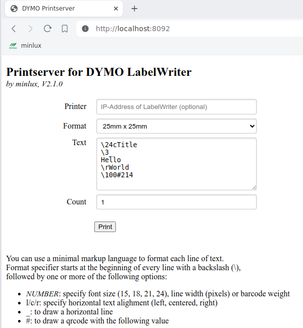

# dymon
Command line tools and printserver (webserver) for DYMO LabelWriter Wireless.



This project implements 3 applications:
- `dymon_cli` and `dymon_pmb` allows printing of labels from command line.
- `dymon_srv` implements a webserver, that allows printing of labels through a REST-API. In addition it serves a site (which is using this REST-API) that allows label printing from by a web form:




## Intro
2018 I bought DYMO's new wireless label printer (*LabelWriter Wireless*). I had the idea to print labels out of an (web)application
containing data like numbers and barcodes dynamically retrieved from a database.

My starting point was the DYMO's LabelWriter SDK. Unfortunately there was little information for LabelWriter Wireless. If found
*LabelWriter 450 Series Printers Technical Reference Manual* via Google but none for *LabelWriter Wireless*. I get in contact with
DYMO's support and asked for a *Reference Manual* for *LabelWriter Wireless* but I got only the one for *LabelWriter 450*.

The *Reference Manual* for *LabelWriter 450 Series Printers* had some useful information but not exactly that what I wanted to know. Searching
around the internet ended up in two interessting projects whose sourcecode contains additional informaiton:
- https://sbronner.com/dymoprint.html
- https://github.com/computerlyrik/dymoprint

Nevertheless I still didn't have all required information to "operatate" the *LabelWriter Wireless* out of my own application.
So it was time for *Wireshark* to capture the communication between the DYMO's label creater software *DYMO Label* and *LabelWriter Wireless*...
To make it short: Based on the information provided in the resouces noted above I managed it to figure out the majority of the TCP communication protocol.


## Findings
For communiction with the *LabelWriter Wireless* TCP port 9100 is used. This makes sense, because port 9100 is reserved for PDL (page description language)
data streams, used for printing to certain network printers. Communicatin is **NOT** encrypted.

The printer implements a kind of *ESC* protocol. The commands are similar as specified in *LabelWriter 450 Series Printers Technical Reference Manual* but not in all cases. Also there are commands, that
aren't described in this document.

Each command starts with `0x1B` followed by a "command selector byte" and optional parameter data. These parameter are little endian encoded.

The label itself is given by a bitmap "blob". In a preceeding header some meta information are defined. Among other things the width (number of columns) and height (number of rows) of the bitmap, the label length, print density, print quality...

The bits of the bitmap blob are mapped to label pixels row by row, column by column (Z)
* It starts in upper left corner with bit 7 of the first bitmap-byte.
* The next pixel (1st row, 2nd column) is followed by bit 6 ...
* There is a wrap around at the end of each row ...
* It ends in the lower right corner with bit 0 of the last byte.

> I just testes this with a label width that is a multipel of 8. So the wrap around is at a byte boundary, and there are no unused trailing bits in the blob. Don't know what happens if this isn't considered!?


## Protocol
Example for printing a 272x252 bitmap to a 25mm X 25mm label with 300x300dpi.

1. Open TCP connection

2. Get status of printer
   1. `0x1B, 0x41, 1` : **A** Send a TCP packet containing 3 bytes (2 byte command, 1 unknown byte)
   2. Receive reply from printer (32 bytes, whose meaning is not known, yet!)

3. Send label data as **ONE** blob
   Either one big packet or multible packets with (all packets but the last) MSG_MORE flag set. ???

   1. Configure label settings (MSG_MORE = true)
      1. `0x1B, 0x73, 1, 0, 0, 0` : **s** Session-Counter, 2 byte command, 32-bit value (meaning of counter unknown)
      2. `0x1B, 0x43, 0x64` : **C** Print-Density, 2 byte command, 1 byte value (0x64 ^= normal)
      3. `0x1B, 0x68` : **h** Printer in 300x300 dpi text mode
      4. `0x1B, 0x4D, 0, 0, 0, 0, 0, 0, 0, 0` : **M** Media/Paper-Type, 2 byte command, 8 byte value (8x0 ^= normal)

   2. Setup label (MSG_MORE = true)
      1. `0x1B, 0x6E, 1, 0` : **n** Label index, 2 byte command, 16-bit value (meaning of index unknown)
      2. `0x1B, 0x44, 0x01, 0x02, 0xFC, 0, 0, 0, 0x10, 0x01, 0, 0` : **D** Bitmap spec, 2 byte command, 2 unknown bytes, 32-bit bitmap height, 32-bit bitmap width (height 252px = 0xFC ^= [0xFC, 0, 0, 0]; width 272px = 0x110 ^= [0x10, 0x01, 0, 0])

   3. Send bitmap "blob" (MSG_MORE = true)

   3. Send "footer data" of label (last packet of blob - MSG_MORE = false)
      1. `0x1B, 0x47` : **G** Short form feed, 2 byte command
      2. `0x1B, 0x41, 0` : **A** Get status, 2 byte command, 1 unknown byte

4. Receive reply from printer (32 bytes, whose meaning is not known, yet!)

5. Send a TCP packet containing following data to output label
   1. `0x1B, 0x45` : **E** Line feed, 2 byte command
   2. `0x1B, 0x51` : **Q** Line tab, 2 byte command

6. Close TCP connection


> Label length is user for form feed. Its scale is 600dpi. In this example: 600 dots * 600 dpi = 1 inch = 25 mm.

> The bitmap blob seems to match the *pbm P4* format (see https://en.wikipedia.org/wiki/Netpbm_format)


### Status Feedback
The meaning of the 32 status bytes read back from the printer are not realy decoded yet. However in byte[15] there seems to be the "paper out" information. If papter is present, this bit is 0. If paper is out, this byte is 1.

When requesting the status with `0x1B, 0x41, 1` then in byte[0] stands a 0. When requesting the status with `0x1B, 0x41, 0` then in byte[0] stands a 1.
Wenn man z.B. 3 Label druckt aber kein Papier drin ist, dann geht steht hier ab dem 2ten `0x1B, 0x41, 0` request eine 2. Das ist wahrscheinlich ein Fehlerflag

In the bytes[1..4] there seems to be the session-counter from the request (cf 3.1.1). Kommt aber nur zum "Vorschein" wenn man mehrere Labels druckt. Und zwar erst ab dem 2ten Status Request mit `0x1B, 0x41, 0` (also nach dem drucken des 2ten Label). Anfangs kommt immer 4x 0. Nach dem Ende des druckens kommt auch wieder 4x 0, wenn man z.B. noch ein paar  `0x1B, 0x41, 1` oder `0x1B, 0x41, 0` Request hinterher schickt.

In the bytes[5..6] there seems to be the label-index-counter from the request (cf. 3.1.7). Hier ist es ählich wie beim Session-Counter. Hier kommt der Wert zurück, den man im Vorherigen Request gesetzt hat. Das gilt aber nicht, für das erste `0x1B, 0x41, 1` und das erst `0x1B, 0x41, 0`. Da kommt dann noch der Wert den man Vorletzen Request gemacht hat. Nach dem Ende des Drucks kann man zuletzt gesetzen Counter Wert auch beliebig oft abrufen (indem man `0x1B, 0x41, 1` oder `0x1B, 0x41, 0` Request schickt).

Dieses "komische" Verhalten, hat bestimmt mit Byte[7] zu tun. Dieses Byte ist beim ersten `0x1B, 0x41, 1` und beim ersten `0x1B, 0x41, 0` immer 0. Wenn man mehrere Labels druckt, ist dieses Byte ab den 2ten `0x1B, 0x41, 0` dann 1. Schickt man nach dem Ende `0x1B, 0x41, 1` oder `0x1B, 0x41, 0` Request, bleibe dies Byte auf 1. Das könnte also so eine Art "letzter Job completed" flag sein. Oder (und das erscheint mir jetzt, während ich drüber nachdenkte fast plausibler) ist es ein Idle-Flag das anzeigt ob der Drucker druckt oder nicht. Beim ersten `0x1B, 0x41, 1` ist der Drucker ja noch *Idle*. Nach dem senden des ersten Labels und dem anschließenden `0x1B, 0x41, 0` ist der Drucker auch noch Idle, weil das ganze "sooooo schnell" ging und der Drucker noch garnicht angefangen hat...
Die anderen Status Bytes:
- Byte[10]: Normal 0x08, wenn kein Papier drin ist und mehrere Label gedruckt werden kommt hier ab dem 2ten `0x1B, 0x41, 0` Request eine 2.
- Byte[20]: Immer 0x01
- Byte[21]: Immer 0x01
- Byte[27]: Immer 0x02
- Byte[28]: Immer 0x02
- alle nicht genannten: Immer 0x00


## Implementation
Most of the application code relates to the creation of the bitmap (text and barcode). The actual code to interface with the *LabelWriter* can be found in the files in folder `dymon` and in `src/print.cpp`.

## Notes
- *Dymon* is an abstact class. There is a specialization for Windows and one for Linux. Those child classes only handles the TCP network access.
- To change the oriantation of the label, the bitmap must be rotated. The bitmap class in this project demostrates this.
- To get an idea how to change the label size/format have a look into `src/print.cpp`. There is an implementation for two different label formats with different orientation.


## How to build
Build process is based on CMake.

1. Create a build directory (e.g. `mkdir build`)
2. Within the build directory execute `cmake ..`
3. Within the build directory execute `make`


## Usage
### dymon_cli
The `dymon_cli` tool expects its input via command line argument:
- 1st argument: the IP of the *LabelWriter* in the local network
- 2nd argument: the labels *title* line
- 3rd/4th argument: label *body* lines
- 5th argument: EAN8 barcode value (max 7 digits. a checksum char is added automatically).

Example:
```
./dymon_cli "192.168.178.49" "Headline is bigger" "than the following..." "...two body lines" 1234567
```


### dymon_pmb
`dymon_pmb` is a command line tool, that allows to print *pmb P4* image files. on the *LabelWriter*.
The tool expects the following arguments:
- 1st argument: the IP of the *LabelWriter* in the local network
- 2th argument: full path to the bitmap file

In folder `doc` you can find some example files that can be printed (on the respective lables) like this:
```
./dymon_pmb 192.168.178.23 ../doc/label_25x25.pbm
./dymon_pmb 192.168.178.23 ../doc/manu_25x25.pbm
./dymon_pmb 192.168.178.23 ../doc/eagle_25x25.pbm
./dymon_pmb 192.168.178.23 ../doc/eagle_36x89.pbm
```

You can use *GIMP* to convert regular image files into pmb files. Therefore just *export* your image as `filename.pbm` and store it as *raw* pmb.
You can also use *Imagemagick* to convert a file into pmb. For example:
```
convert your_pic.jpg your_pic.pbm
```

You can also do more advanced conversion at once using *Imagemagick's convert*. The following command resizes an image but keeps the aspect ration. It will be resized so that the width is maximal 960 pixel, the height is maximal 392 pixel. It depends on the geometry of the input image which rule applies. Then it extends the canvas to 960x392 and aligns the image centered in the canvas. Then the image is rotated by 90 degrees (counter clockwise). Finally it is converted to pbm p4. The resulting image would fit to a 36mm x 89mm label.
```
convert -resize 960x392 -extent 960x392 -gravity center -rotate 90 eagle.jpg eagle_36x89.pbm
```

Same for a 25mm x 25mm label:
```
convert -resize 272x252 -extent 272x252 -gravity center logo.svg logo.pbm
```


### dymon_srv
`dymon_srv` implements a HTTP-webserver. It TCP port, the webserver is listening to can be set with the first command line argument (default: 8092).
Start the webserver like showen in the example below. Then open you webbrowser to `localost:8092`. Fill in the form data and click the respective button to print the label(s).

Example:
```
./dymon_srv 8092
```


## See also
[Commands and Status](doc/cmd_status.md)
[Labels](doc/paper_size.md)
