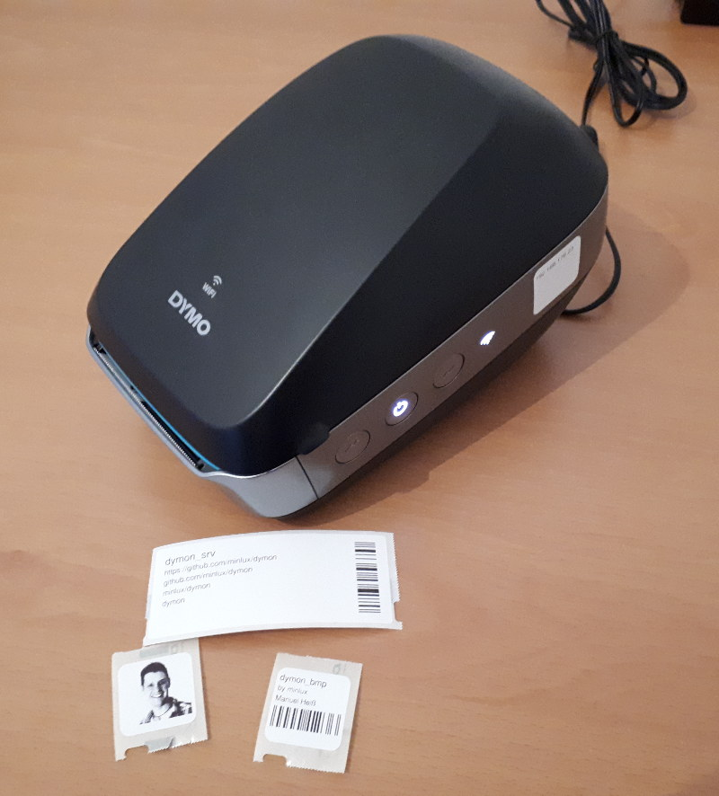
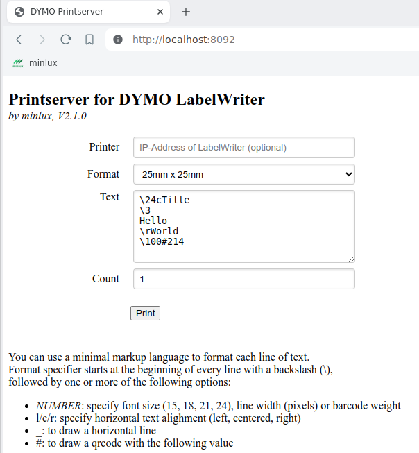
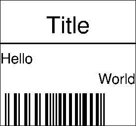

# dymon
Command line tools and printserver (webserver) for DYMO LabelWriter (Wireless, 450, 550).



This project implements 3 applications:
- `dymon_pbm` allows printing of labels from command line.
- `dymon_srv` implements a webserver, that allows printing of labels through a REST-API. In addition it serves a site (which is using this REST-API) that allows label printing via a web form.
- `txt2pbm` is a little helper tool, to create a pbm file from text.


## Intro

2018 I bought DYMO's new wireless label printer (*LabelWriter Wireless*). I had the idea to print labels out of an (web)application
containing data like numbers and barcodes dynamically retrieved from a database.

My starting point was the DYMO's LabelWriter SDK. Unfortunately there was little information for LabelWriter Wireless. I found
*LabelWriter 450 Series Printers Technical Reference Manual* via Google but none for *LabelWriter Wireless*. I got in contact with
DYMO's support and asked for a *Reference Manual* for *LabelWriter Wireless* but I got only the one for *LabelWriter 450*.

The *Reference Manual* for *LabelWriter 450 Series Printers* had some useful information but not exactly that what I wanted to know. Searching
around the internet ended up in two interesting projects whose sourcecode contains additional information:
- https://sbronner.com/dymoprint.html
- https://github.com/computerlyrik/dymoprint

Nevertheless I still didn't have all required information to "operate" the *LabelWriter Wireless* out of my own application.
So it was time for *Wireshark* to capture the communication between the DYMO's label creator software *DYMO Label* and *LabelWriter Wireless*...
To make it short: Based on the information provided in the resources noted above I managed it to figure out the majority of the TCP communication protocol. The details are documented in [protocol.md](protocol.md).


## Implementation

Most of the application code relates to the creation of the bitmap (text and barcode). The actual code to interface with the *LabelWriter* can be found in the files in folder `dymon` and in `src/print.cpp`.

- *Dymon* is an abstract class. There is a specialization for Windows and one for Linux. Those child classes only handles the TCP network access.
- To change the orientation of the label, the bitmap must be rotated. The bitmap class in this project demonstrates this.
- To get an idea how to change the label size/format have a look into `src/print.cpp`. There is an implementation for two different label formats with different orientation.


## Build

See [build.md](build.md).


## Usage

### dymon_pbm

```
Print P4 portable bitmap on DYMO LabelWriter.

Usage: dymon_pbm
 [--help] [--version] [--usb=<DEVICE>] [--net=<IP>] [--model=<NUMBER>] [--copies=<NUMBER>] [--debug] <INPUT>

Options:
  --help                    Print help and exit
  --version                 Print version and exit
  --usb=<DEVICE>            Use USB printer device (e.g. '/dev/usb/lp1')
  --net=<IP>                Use network printer with IP (e.g. '192.168.178.23')
  --model=<NUMBER>          Model number of DYMO LabelWriter (e.g. '450')
  --copies=<NUMBER>         Number of copies to be printed [default: 1]
  --debug                   Enable debug output
  <INPUT>                   PBM file to be printed
```

The printer backend is selected by exactly one of the following options:

- `--usb` — connect to a printer attached via USB.
- `--net` — connect to a network printer by IP address. Useful for the *LabelWriter Wireless* or any printer accessible over TCP.

Note: At least for LabelWriter 450, it is mandatory to set `--model`<br>
Note: On Windows you have to specify the `--usb` *DEVICE* by means of vendor-/product-id. E.g. `vid_0922` or more specific `vid_0922&pid_0028`.

See [pbm.md](pbm.md) for details on how to create PBM files using `txt2pbm`, GIMP, or Imagemagick.

**Examples:**

In folder `doc` you can find some example files that can be printed (on the respective labels) like this:

```
./dymon_pbm --net 192.168.178.23 ../doc/manu_25x25.pbm
./dymon_pbm --usb /dev/usb/lp0   ../doc/eagle_25x25.pbm     //Linux
./dymon_pbm --usb vid_0922       ../doc/eagle_36x89.pbm     //Windows
```


### dymon_srv

```
Usage: dymon_srv
 [--help] [--version] [--usb=<DEVICE>] [--net=<IP>] [--dir=<DIRECTORY>] [--model=<NUMBER>] [-p <NUMBER>] [--serve=<PATH>] [--debug]

Options:
  --help                    Print help and exit
  --version                 Print version and exit
  --usb=<DEVICE>            Use USB printer device (e.g. '/dev/usb/lp1')
  --net=<IP>                Force use of network printer with IP (e.g. '192.168.178.23')
  --dir=<DIRECTORY>         Print labels as PBM files into directory
  --model=<NUMBER>          Model number of DYMO LabelWriter (e.g. '450')
  -p, --port=<NUMBER>       TCP port number of server [default: 8092]
  --serve=<PATH>            Path to directory statically served by HTTP server
  --debug                   Enable debug output
```

The printer backend is controlled by the following options:

- *(none)* — default mode: sends each label to a network printer using the `ip` field from the `POST /labels` payload. This allows one central server to distribute labels to multiple different printers.
- `--net` — forces all labels to the given IP address, ignoring the `ip` field in the payload. Useful when all labels should always go to the same printer.
- `--usb` — sends labels to a USB-attached printer. The `ip` field in the payload is ignored.
- `--dir` — instead of printing, writes each label as a PBM file into the given directory. The `ip` field in the payload is ignored. The optional `meta` field is embedded as a comment in the generated PBM file. Useful for testing, previewing labels, or integrating with other tools that consume PBM files.

Note: At least for LabelWriter 450, it is mandatory to set `--model`<br>
Note: On Windows you have to specify the `--usb` *DEVICE* by means of vendor-/product-id. E.g. `vid_0922` or more specific `vid_0922&pid_0028`.

**Examples:**

```
./dymon_srv --serve ../../www
./dymon_srv --serve ../../www --net 192.168.178.23
./dymon_srv --serve ../../www --usb /dev/usb/lp0   //Linux
./dymon_srv --serve ../../www --usb vid_0922       //Windows
```

Start the webserver like shown in the example below. Then open your webbrowser to `localhost:8092` and follow the links to the examples. Click the **print** button in the respective example to get a label.

Eg. *Labelwriter*:



This will print a label like:



**REST API example:**

```bash
curl -X POST "http://localhost:8092/labels" \
     -H "Content-Type: application/json" \
     -d '{
           "ip": "192.168.178.67",
           "width": 272,
           "height": 252,
           "orientation": 0,
           "text": "Hello World\nminlux.de",
           "meta": "my-label-id",
           "count": 1
         }'
```

The optional `meta` field is embedded as a comment in the generated PBM file when `dymon_srv` is run with a `--dir` output directory. It can be used to tag generated files with an identifier (e.g. a record ID) for later reference.

The format specifiers that can be used in the `text` string are explaind in  [pbm.md](pbm.md).

See also the *openapi* description of the REST endpoints:
- [YAML](doc/dymon_srv.yaml)
- [PDF](doc/dymon_srv.pdf)


## Note on LabelWriter 550

The LabelWriter 550 includes NFC-based hardware DRM. Original DYMO label rolls contain an NFC chip in the paper core that transmits the label type and the number of labels remaining. If non-DYMO labels are inserted, the printer refuses to operate.

If you want to use third-party labels with a LabelWriter 550, have a look at [free-dmo-stm32](https://github.com/free-dmo/free-dmo-stm32), a hardware hack that emulates the NFC chip.


## See also

- [Protocol](protocol.md)
- [PBM Creation](pbm.md)
- [Build](build.md)
- [Release](release.md)
- [Commands and Status](doc/cmd_status.md)
- [Labels](doc/paper_size.md)
- [DYMO Developer SDK Support Blog](https://developers.dymo.com/#/article/1417)
- [minlux - Home](https://minlux.de)
